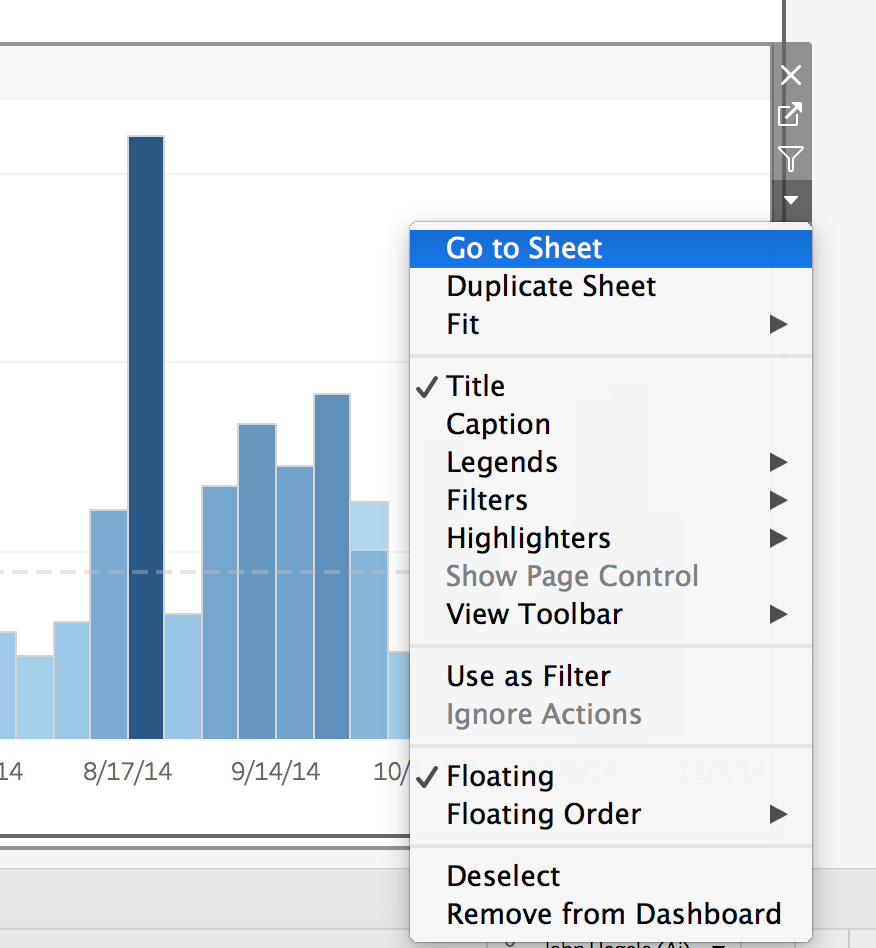
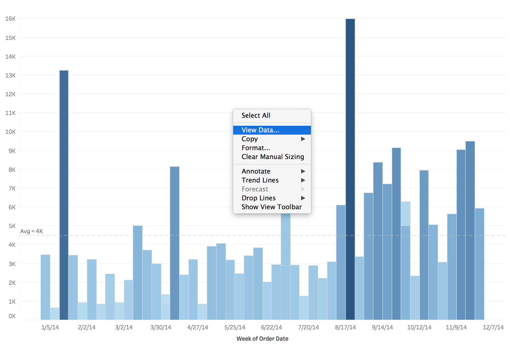
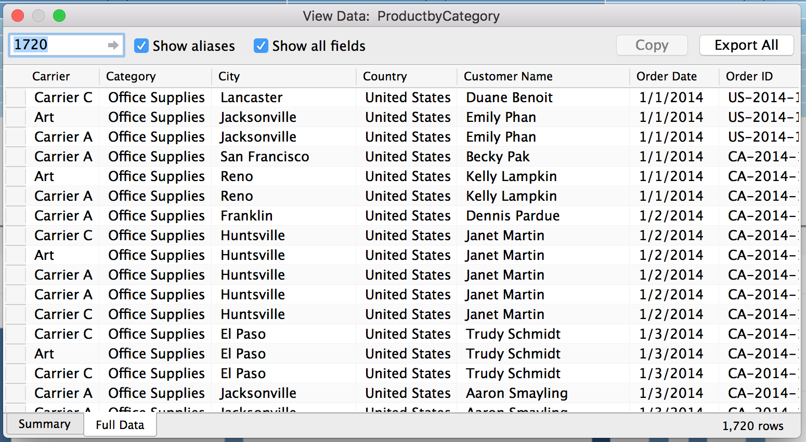

**NOTE: This set of tutorials is intended for developers interested in building fully custom Wordsmith and Tableau integrations. If you are not a developer, please log in to your Wordsmith account to access our knowledge base and other tutorials.**

# Step 1: Planning

> **Author's Note:** If you haven't yet, make sure you check out the previous guides in this series. Each guide builds upon the prior guides.

*We are constantly working on updates and improvements to the Wordsmith platform, some of the images below may be dated but we will make every effort to keep this tutorial up-to-date in terms of actual Wordsmith usage.*
>
> [Step 0: Boilerplate](https://github.com/ai-invent/tableau-wordsmith-tutorials/tree/master/Step%200:%20Boilerplate)

Every good project begins with good planning...or something like that. Since we're going to integrate two platforms, each of which uses its own, unique data structure, we primarily need to figure out how to get the data that exists in Tableau into a format that allows us to build the narrative that we want in Wordsmith.

In the interest of keeping it simple to start with, let's aim to produce a single sentence from Wordsmith using data from our [YTD Sales by Product viz](https://public.tableau.com/profile/austin.bello2812#!/vizhome/YTDSalesbyProduct/YTDSalesbyProduct). We won't (yet) be producing narrative but what we do here will make the rest of our work markedly easier so don't gloss over this. In fact, while the contents of later guides may be relevant to your project, the contents of this single guide will be relevant to **every** custom Tableau + Wordsmith build you do.

## The Tableau Side of Things

Let's start by understanding some concepts and tricks that can be helpful when working in Tableau to plan a custom Tableau + Wordsmith build.

### How the Tableau JS API Returns Data

If you are unfamiliar with the Tableau Javascript API, it might be worth exploring the broad concepts. Tableau maintains full documentation for this API [here](https://onlinehelp.tableau.com/current/api/js_api/en-us/JavaScriptAPI/js_api_ref.htm). The key concepts to focus on are that a Viz is comprised of workbooks and a workbook is comprised of worksheets. Generally, workbooks will be represented as tabs while worksheets correspond to each individual visual element on a tab. If you have a viz with no tabs that contains a bar chart, a line chart, and a heatmap then chances are your viz has one workbook and three worksheets (one for each chart type).

It's important to understand this structure because we will be using the Tableau JS API to pull data on a per-worksheet basis. So, we'll need to understand which sheets have relevant data and how that data is structured. 

### Using Tableau Desktop to Understand The Data

Having access to Tableau Desktop is tremendously helpful in the planning process. As mentioned above, the Tableau Javascript API gives us access to Summary and Full (note that Full data is referred to as Underlying data in the Tableau JS API) data on a per-worksheet basis. So, at a minimum we need to know the names of the sheets we're interested in working with. While that info can be gathered using the Tableau JS API, it's easier and faster to do it using Tableau Desktop.

While viewing a viz in Tableau Desktop, you can quickly go to the sheet corresponding to a visual element by using the drop down menu for the visual element and selecting `Go to Sheet`. Each sheet has a unique name which appears in the tab just below the sheet.



Once you are viewing the worksheet containing the data that you'd like to work with, you can right click (typically you'll need to right click into some whitespace which can be tricky depending on the viz type) and select `View Data...`.



This will bring up a dialog box with tabs at the bottom labeled `Summary` and `Full Data`. Below is the dialog box for the bar chart in our YTD Sales by Product viz.



Generally, summary data represents the aggregated set of data required to build the visualization itself while full data represents the disaggregated set of data that was used to build the summary data. For our first example, we'll rely on the summary data however, in production solutions, we tend to use the full data a lot more often than the summary data. We'll get into why that is the case in the next section.

## Thinking Like a Wordsmith

### Starting At The End

Surprisingly, the best starting point for a Tableau + Wordsmith integration is at the end. By that, I mean that it can be tremendously helpful to write out a static version of the narrative you'd like to produce before you ever get into coding or Wordsmith. Working backwards from the static narrative is helpful in identifying what data we need in Wordsmith in order to dynamically produce a narrative. For example, consider the sentence:

```Sales rose quarter over quarter.```

Now think through what kind of data we need to dynamically build that sentence. In this example, we will need two data points: the value of sales in the current quarter and the value of sales in the prior quarter. Using those two data points we can compare and generate narrative that captures the comparison between quarters.

> **Author's Note**: I sometimes think it's easier to think of these datapoints as being attributes of the narrative. It's really an aesthetic difference and, for these guides, I'll try to consistently use "data point" rather than "attribute" but consider this a disclaimer in case I slip up somewhere!

At this point, let's take a [look at our viz again](https://public.tableau.com/profile/austin.bello2812#!/vizhome/YTDSalesbyProduct/YTDSalesbyProduct). Keep in mind that we'll only be working with the bar chart so ignore the heatmap for now. As mentioned in the prior section, it'll be helpful to open this in Tableau Desktop so download the viz, open it in Desktop and use the `Go To Sheet` functionality to identify that we'll be working with a worksheet named `ProductbyCategory`. Then use the `View Data...` functionality to check out the summary data that sits under the bar chart.

As a quick aside, take a moment to flip over to the Full Data tab as well. Notice that, in the summary data you have a pre-aggregated set of 51 rows and 8 columns whereas the full dataset contains 1,720 rows and 34 columns! If you want to build a rich narrative, it's pretty clear that the full dataset gives you a lot more to work with. Naturally, the trade off is that a larger dataset may add to the complexity of the build. But, you'll likely find that the full dataset is consistent between visualizations so while it may add complexity it also tends to give you a single, unified dataset to work with whereas using summary data may mean you need to pull together multiple, disparate datasets in order to build your narrative.

But, back to our analysis of the summary data. The data, as represented in the chart, is weekly. To make our narrative interesting and avoid simply regurgitating what a user can clearly see on the chart, let's build some narrative that identifies the largest quarter by average deal size and by total sales. So, our resultant narrative should look something like this:

```Superstore's best quarter for total sales was <sales_best_quarter> in <sales_best_quarter_year>, however the top quarter by average deal size was <deal_size_best_quarter> in <deal_size_best_quarter_year>.```

We've used placeholders here (our placeholder names are inside brackets `<like_this>`) for certain values here. Note that the formatting of these placeholder names is intentional. Wordsmith uses this as a standard naming convention for data elements. You may have also noticed that the phrasing we've used here will be dependent upon comparing the quarters. We wouldn't use our "however" phrasing if the top sales quarter and the top deal size quarter were the same so we'll address that once we're in Wordsmith. 

In general, this gives us a good starting point. We know that, from the `ProductbyCategory` worksheet, we'll need to work with the Summary dataset and we need to build four different datapoints that will allow Wordsmith to produce dynamic narrative. Below is a summary of the information we will need based on our planning.

## Everything We Need

**Sheet Name**: `ProductbyCategory`<br />
**Dataset**: `Summary`<br />
**Data Points Needed**: `sales_best_quarter`, `sales_best_quarter_year`, `deal_size_best_quarter`, `deal_size_best_quarter_year`