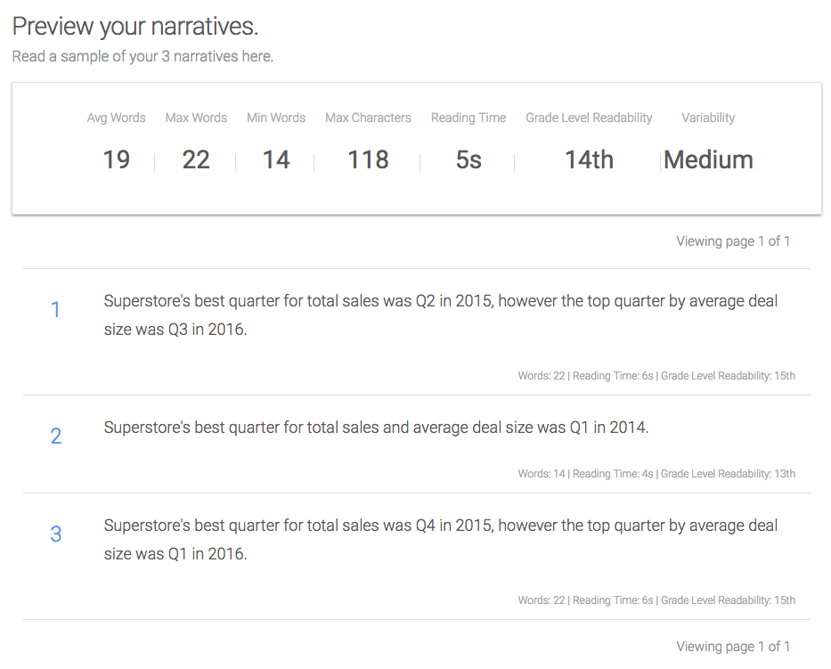
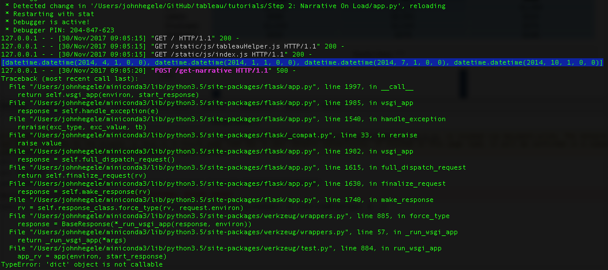

**NOTE: This set of tutorials is intended for developers interested in building fully custom Wordsmith and Tableau integrations. If you are not a developer, please log in to your Wordsmith account to access our knowledge base and other tutorials.**

# Step 2: Narrative On Load

> **Author's Note:** If you haven't yet, make sure you check out the previous guides in this series. Each guide builds upon the prior guides.
>
> [Step 0: Boilerplate](https://github.com/ai-invent/tableau-wordsmith-tutorials/tree/master/Step%200:%20Boilerplate)<br />
> [Step 1: Planning](https://github.com/ai-invent/tableau-wordsmith-tutorials/tree/master/Step%201:%20Planning)

The time has arrived, we're ready to start doing some coding! :tada:

Since we now know what data points we need to build our narrative, we'll start in Wordsmith. Then we'll come back and use Javascript and Python to transform data we pull from Tableau into a Wordsmith-ready format.

## Wordsmith

Recall from [Step 1](https://github.com/ai-invent/tableau-wordsmith-tutorials/tree/master/Step%201:%20Planning) that our first objective is to produce this narrative: 

```
Superstore's best quarter for total sales was <sales_best_quarter>
in <sales_best_quarter_year>, however the top quarter by average 
deal size was <deal_size_best_quarter> in <deal_size_best_quarter_year>.
```

This requires four different data points, each of which is identified in the narrative itself. So, let's build this narrative in Wordsmith.

### Setting Up

In Wordmsith, click the New Project button. This will bring you to the Create a Project page with an empty table. The column names (in green) correspond to the data points that will power our narrative. In this step, we can only build 3 data points but don't worry, we'll add the fourth shortly.

Let's build our first three data points and provide some sample data. Your table should look like this:

| sales_best_quarter | sales_best_quarter_year | deal_size_best_quarter |
|:---:|:---:|:---:|
| 2 | 2015 | 3 |
| 1 | 2014 | 1 |
| 4 | 2015 | 1 |

Push the Create Template button. This will take you into the editor interface. Rather than start typing right away, let's add that fourth data point. Click the Data menu item on the left and you'll be taken to the data interface where you'll see the three data points and three sample rows we just created. To the right of your headers, you'll see `+ Add Column`. Fill it in so that your table now looks like this:

| sales_best_quarter | sales_best_quarter_year | deal_size_best_quarter | deal_size_best_quarter_year |
|:---:|:---:|:---:|:---:|
| 2 | 2015 | 3 | 2016 |
| 1 | 2014 | 1 | 2014 |
| 4 | 2015 | 1 | 2016 |

Press the Save Changes button, then click the Write menu option on the left. Now we're ready to start writing! 

## Writing

### Inserting Data

We'll begin by simply building a mail-merge version of our narrative where we are simply inserting data into the text. So, type the following:

```Superstore's best quarter for total sales was Q```

Now press the Insert Data button and choose `sales_best_quarter`. This takes you to a formatting screen. Since we are dealing with quarters here, we don't need a thousands separator so you can deselect that option, otherwise leave everything as-is so that the final formatting looks like this:


Press Done. Type ` in ` (space, then the word "in", then another space) and press the Insert Data button and choose `sales_best_quarter_year`. Again we'll deselect the thousands separator option and press Done. Continue typing:

`, however the top quarter by average deal size was Q`

Use Insert Data to insert the `deal_size_best_quarter` (remember to deselect the thousands separator option). Continue typing ` in ` then insert the `deal_size_best_quarter_year`. Finish your sentence with a period. At this point, your Wordsmith narrative should look like this:


Let's use Wordsmith's Review option to check our narrative using the three example rows that we built. Click the Review option on the left and you'll see a screen that looks something like this:


The first and third narratives look OK (given that we are aiming for simplicity) but our second narrative is clearly something that a human would never write. As we touched on briefly in our planning section, the "however" clause in our sentence is going to be dependent upon whether the top quarter for sales and deal size are equivalent. In the case of our second narrative, Q1 2014 was top for sales and deal size so we end up with this very unnatural result:

```
Superstore's best quarter for total sales was Q1 in 2014, however
the top quarter by average deal size was Q1 in 2014.
```

Not great, but we can fix that using a branch. 

## Adding A Branch

Let's get to it. Click the Write menu option on the left to return to the editor. Now let's decide how we'd modify our sentence structure to fix the issue we see in the narrative above. If we were to rewrite that sentence, it would read much better as:

```
Superstore's best quarter for total sales and average deal size was Q1 2014.
```

So, we can keep everthing up to the space that follows the word "sales" static but, after that we'll need to check to see if top sales and top deal size occurred in the same quarter. Let's highlight everything after that space and before the final period, then press Add Branch.


This is the branch creation window. We'll only have two conditions in the branch we'll build but, for your own projects, you can add as many conditions as you'd like and you can also nest branches within each other. But, for our simple example, let's fix that issue we're working on.

Since we highlighted existing text before clicking Add Branch, Wordsmith has filled our top branch condition with the text that was highlighted. We need to supply a condition which, if `true` should cause that text to be written. The text here reads:

```was in Q2 in 2015, however the top quarter by average deal size was Q3 in 2016```

We only want to write that if top sales and top deal size occurred in different quarters. So, we can say that if the top sales quarter is not equivalent to the top deal size quarter **or** the top sales quarter year is not equivalent to the top deal size quarter year, then we have two different quarters for these metrics. In the box that reads "If this is true:", type the following condition:

```(sales_best_quarter != deal_size_best_quarter) or (sales_best_quarter_year != deal_size_best_quarter_year)```

Now we will only generate that text if that specific condition is met. But we need to add our new narrative to handle situations where the top sales and top deal size occur in the same quarter. Underneath the box we've been working on, you'll see links that read "Add another rule" and "Add text if no rules are true." If we wanted to specify another condition, we'd use "Add another rule" but, in our case, there are only two potential states that we are concerned about: top sales and deal size happened in the same quarter or they didn't. So, click the "Add text if no rules are true" link and you'll see a new box added that reads "If none of the above are true, then write:."

Let's add our new text to this box. Write:

```and average deal size was Q```

Click Insert Data and choose `sales_best_quarter`. Then write ` in ` and click Insert Data once more and choose `sales_best_quarter_year`. For each of these, remember to deselect the thousands separator option (if you forgot, just click on the data variable and it'll open the formatting options for you). Your branch window should look like this now:


> **Author's Note**: You may wonder why we don't use `deal_size_best_quarter` or `deal_size_best_quarter_year` here. Recall that the primary purpose of this branch is to check whether the top sales and deal size quarters are equivalent. In our second condition, we know that they are, in fact, equivalent so we can use our sales and deal size data points interchangeably.

Let's go back to that review page and see how things look now:



To make life easier, let's rename our project and template. At the top of the review page, to the right of the Wordsmith logo you should see something like `Project X > Project X Template`. Click the pencil icon to the right of this and rename "Project X Template" to "Wordsmith Tutorial Template". Now click on "Project X" and, on the project page, click the same pencil icon and change "Project X" to "Wordsmith Tutorial". To make sure that everything updated properly, click on the Dashboard menu option. You should now see a project named "Wordsmith Tutorial" click on that. Inside that project should be a template named "Wordsmith Tutorial Template", click on that and you should be back in the editor.

Perfect. We're well on our way to automating our writing. We'll expand on this narrative a bit in the future guides but, for now, this let's us get something up and running with Tableau.

## Javascript

As promised, it's time to code! Keep in mind that the code here is not meant to be production-ready and will rely on using a modern, updated browser to run properly. I highly suggest Chrome if it's an option. Firefox also tends to work well.

We are going to use the code that is available in [Step 0: Boilerplate](https://github.com/ai-invent/tableau-wordsmith-tutorials/tree/master/Step%200:%20Boilerplate). Go ahead and either clone that repo or download a zip file of the code there.

### Embedding Our Viz

The first thing we need is a viz! We will be working with the [YTD Sales by Product](https://public.tableau.com/profile/austin.bello2812#!/vizhome/YTDSalesbyProduct/YTDSalesbyProduct) viz hosted on Tableau Public. While this specific viz is on Tableau Public, you'll follow the same basic steps to embed a viz from Tableau Server or Tableau Online. The only difference is that a viz from Tableau Server or Online will not load until the user is authenticated.

Go ahead and open up the viz on Tableau Public. Scroll to the bottom of the viz and you'll see a gray menu bar that spans the entire bottom. On the right-hand side is a share icon, click it and you'll see a modal window open with two fields, Embed Code and Link. Copy the contents of the Link field.


Now, in the code that you cloned or downloaded, navigate to the `static` folder, then the `js` folder and open up the `index.js` file. On line two, between the single quotes, paste the link that you copied from Tableau Public. Line 2 should now look like this:

```javascript
const vizShareUrl = 'https://public.tableau.com/views/YTDSalesbyProduct/YTDSalesbyProduct?:embed=y&:display_count=yes';
```

Save the file. Using Terminal or Command Prompt, navigate to the directory where your code is located. Then use either `python app.py` or `python3 app.py` to launch your web app. By default, the app will run on port 5000. Open your browser and type `localhost:5000` into the address bar to view the web app.

You'll get a blank screen which may be unexpected but, in this case it's because this viz was built to span the width of its container and, because of the way we have our page laid out, the viz doesn't know how to adapt to the width. It's a simple fix and one that we only need to worry about for vizzes that aren't built with a fixed width. In order to correct this, let's move to the `templates` folder and make a quick change to the `index.html` file. We need to specify a height and width for the `div` element that will contain our viz. Current, that element on line 23 looks like this:

```html
<div class="col-sm-9" id="tableauViz"></div>
```

We will arbitrarily choose a size of 800 pixels by 600 pixels for our viz. So let's update that line to look like this:

```html
<div class="col-sm-9" id="tableauViz" style="width: 800px; height: 600px;"></div>
```

Save the file and reload your browser. You should now see the viz load as an embedded element. Now that we have that sorted out, let's get to work on some Javascript.

### Getting Data From Our Viz

The first step is to get data out of Tableau. Recall that, in our last step, we restricted our focus to the bar chart at the bottom of the viz. That chart is on a sheet named `ProductbyCategory` and we want to pull the summary data. Let's do that and log it to the console to check the result.

In our `loadViz()` function, add the following after line 23:

```javascript
th.getSheet('ProductbyCategory').getSummaryData(defaultOptions, []).then((data) => {
    console.log(data);
});
```

This uses our TableauHelper library to get a worksheet object, then get the summary data from that worksheet object. If everything worked, you should see something like this in the Javascript console of your browser:


That last line that reads `{columns: Array(8), data: Array(51)}` is the data structure from our `ProductbyCategory` worksheet. Take a look at the viz in Tableau Desktop and view the data for the bar chart. You'll see that there are 8 columns and 51 rows so everything matches up. Let's make a note of our column names here as we'll need those once we start working with the data:

| Index | Column Name |
|:---:|---|
| 0 | QUARTER(Order Date) |
| 1 | WEEK(Order Date) |
| 2 | AGG(Avg Deal Size) |
| 3 | ATTR(Segment) |
| 4 | ATTR(Sub-Category) |
| 5 | CNTD(Customer Name) |
| 6 | CNTD(Order ID) |
| 7 | SUM(Sales) |

From this point, there are options. We have our tabular data and we need to transform it to Wordsmith-ready data. There are a quite a few ways to handle this. I tend to prefer passing the data from our TableauHelper library directly to our back-end process and aggregate it there before sending to Wordsmith. So, let's work on that. Let's pass this data structure to our Python back-end.

Line 25 of `index.js` is currently where we are logging our data to the console. Let's change that so that we're passing our data structure to the `getNarrative()` function. Update line 25 to this:

```javascript
getNarrative(data);
```

Save and reload and you should now see an error message display to the left of our viz. If you check the Javascript console you'll notice that there was a 500 error. That's OK, that means that our request did get sent to the server so we're making progress! That's all we need to do (for now) on the JS side, let's move our focus to the Python code and put the last piece of this puzzle together.

## Python

At this point, we have our viz embedded, we're getting data from the bar chart, and we're passing that data to our Python back-end. If you check your terminal, you'll likely see a traceback documenting an error. That's happening because, after the data is passed to our back-end process, the `build_wordsmith_data()` function is not complete.

### Aggregating Our Data

Open `app.py`.

Recall, from [Step 1: Planning](https://github.com/ai-invent/tableau-wordsmith-tutorials/tree/master/Step%201:%20Planning) that we ultimately need to transform the tabular data from Tableau into a set of four data points:

* `sales_best_quarter`
* `sales_best_quarter_year`
* `deal_size_best_quarter`
* `deal_size_best_quarter_year`

Since we'll be looking at quarterly data, we'll make use of the `QUARTER(Order Date)` column. Within Tableau Desktop, quarterly data shows up as an integer (i.e. Quarter 1 2014 just appears as 1) but, in the Tableau Javascript API, quarterly data is represented as a datetime so Quarter 1 is returned as "2014-01-01 00:00:00". In fact, we can double check this in our Python code. Within the `build_wordsmith_data()` function, add this at line 38 (the line after we define the `tableau_data` variable)

```python
print(tableau_data.distinct('QUARTER(Order Date)'))
```

Save the file which should automatically trigger the application to reload (you can check your terminal or command prompt to validate that it restarted). Refresh the web app in your browser and go back to your terminal and you should see something like this:



I've highlighted the relevant line in the above image. That line is where we are printing the unique values from the `QUARTER(Order Date)` column. This also demonstrates how the `tableau_data` library automatically parses a datetime string from Tableau's Javascript API into a Python datetime object for you. So, now that we understand the format we're dealing with, we can start working on building those four data points that we need to send to Wordsmith.

#### Using the `tableau_data` Library

> *Author's Note*: Full documentation for the `tableau_data` library can be found [here](https://github.com/ai-invent/tableau-data-python). If you plan to use this library, I'd suggest reading through the documentation.

OK, we have our data. It is actually aggregated at a weekly level but we want to translate that to quarterly. Let's work on getting total sales by quarter first. Let's delete the print statement that we added on line 38 along with the placeholder comment below it (the comment reads "# Add your code here to transform the dataset"). Starting at line 38, add this code:

```python
aggregated_data = []
for quarter_data in tableau_data.by('QUARTER(Order Date)'):
    aggregated_data.append(dict(
        quarter=int((quarter_data[0]['QUARTER(Order Date)'].month - 1) / 3) + 1,
        year=quarter_data[0]['QUARTER(Order Date)'].year,
        total_sales = sum([row['SUM(Sales)'] for row in quarter_data.rows()])
    ))
```

Basically, what we are doing here grouping the values in the `QUARTER(Order Date)` field then summing up all the sales for each distinct value in that column. We take the result and store it in a list along with the quarter number (as an integer) and the year. Before we work on pulling out the highest quarter for total sales, let's add in the average deal size. We'll make a small modification to the code above to do this.

Add a comma to the end of line 43 (this is the line where we assign `total_sales` to the sum of sale) then, on the line below, add this:

```python
deal_size = sum([row['SUM(Sales)'] for row in quarter_data.rows()]) / len([row['SUM(Sales)'] for row in quarter_data.rows()])
```

Just so I don't look like a complete buffoon, yes, this is a wildly inaccurate way to calculate average deal size because we are taking the average of averages. That's OK for our purposes as we're just looking to work through basic concepts. If you want to be more precise, feel free to modify the code accordingly. But we're going to forge ahead with our simple (albeit incorrect) calculation. If you want to see what the final `aggregated_data` variable looks like, go ahead and add `print(aggregated_data)` just after line 45. Save the file and refresh your browser and, in your terminal you should see something like this:


If you added a print statement to check out the `aggregated_data` variable, go ahead and delete that. Now that we have sales and average deal size by quarter, all we need to do is sort our list and pull out the relevant fields. We're nearly there! Let's add a few lines that sort by sales and deal size then pull the quarter and year values. After line 45, add the following:

```python
sales_best = sorted(aggregated_data, key=lambda k: k['total_sales'])[-1]
deal_size_best = sorted(aggregated_data, key=lambda k: k['deal_size'])[-1]
```

Now we have our top sales and top deal size quarters. Let's transform this to a dataset that we can pass to Wordsmith. Line 47 should currently read `wordsmith_data = None`, delete that and, in it's place add the following:

```python
wordsmith_data = dict(
    data = dict(
        sales_best_quarter = sales_best['quarter'],
        sales_best_quarter_year = sales_best['year'],
        deal_size_best_quarter = deal_size_best['quarter'],
        deal_size_best_quarter_year = deal_size_best['year']
    )
)
```

Note that we're creating a nested dictionary structure here. Wordsmith data has to be passed inside a `data` element so you need a JSON object with this structure:

```javascript
{
    "data": {
        "variable1": "string",
        "variable2": 2
    }
}
```

OK, we're ready to send everything off to Wordsmith! At this point, everything should be wired up so, let's enter your API key, project slug, and template slug from Wordsmith starting at line 7. To find your API key, log in Wordsmith and go to the Dashboard. Click on API Access on the left and copy the API key from that page and fill it in for `wordsmith_api_key`. Now click on your Wordsmith Tutorial project, then the Wordsmith Tutorial Template. The project and template slugs are in the URL in your browser. Your URL should look something like this:

```
https://wordsmith.automatedinsights.com/projects/wordsmith-tutorial/templates/wordsmith-tutorial-template/edit#/editor
```

The project slug immediately follows `/projects/` while the template slug immediately follows `/templates/`. So, for our example, the project slug is `wordsmith-tutorial` and the template slug is `wordsmith-tutorial-template`. Enter those values for lines 8 and 9, respectively. Save the file and refresh your browser.

Rejoice for there is narrative! Or at least I hope there is. Your web app should now look like this:


This was a really dense guide so I applaud you for making it through. The good news is, the rest of our guides will build on the the foundation that we've laid here so, while there is a lot here, it's absolutely critical to build an understanding of this material.