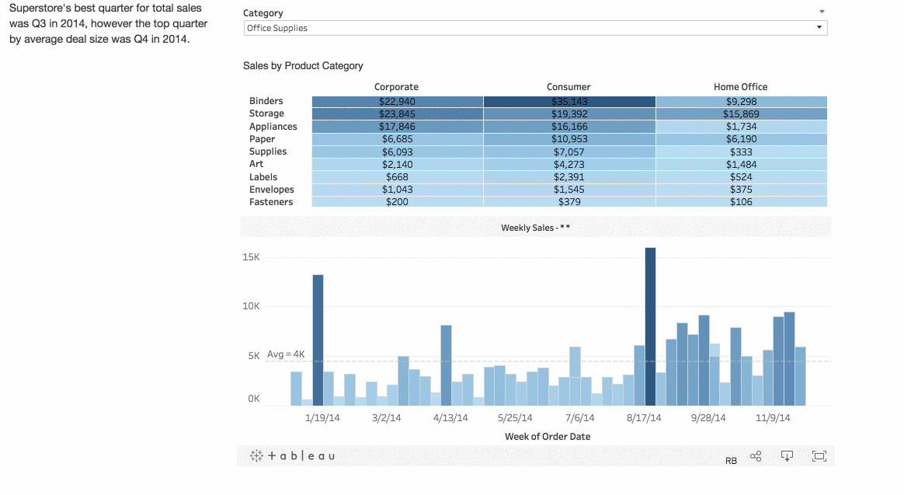

**NOTE: This set of tutorials is intended for developers interested in building fully custom Wordsmith and Tableau integrations. If you are not a developer, please log in to your Wordsmith account to access our knowledge base and other tutorials.**

# Step 3: Making Narrative Dynamic

> **Author's Note:** If you haven't yet, make sure you check out the previous guides in this series. Each guide builds upon the prior guides.
>
> [Step 0: Boilerplate](https://github.com/ai-invent/tableau-wordsmith-tutorials/tree/master/Step%200:%20Boilerplate)<br />
> [Step 1: Planning](https://github.com/ai-invent/tableau-wordsmith-tutorials/tree/master/Step%201:%20Planning)<br />
> [Step 2: Narrative On Load](https://github.com/ai-invent/tableau-wordsmith-tutorials/tree/master/Step%202:%20Narrative%20On%20Load)

In the previous guide, we got narrative to generate when our viz loads and that's awesome but what about when this happens?



If a user changes the filter, our narrative doesn't update. We end up with narrative that is probably completely wrong which isn't great. But, we can fix that and, thanks to the work we did previously, it's a really simple fix.

## Tableau Event Listeners

The Tableau Javascript API gives us access to a [bunch of different event listeners](https://onlinehelp.tableau.com/current/api/js_api/en-us/JavaScriptAPI/js_api_ref.htm#ref_head_13). If you aren't familiar with event listeners, no worries, just think of them as a means to trigger some part of your code based upon an event occurring. While Tableau supports numerous different types of event listeners, there are really only a handful that get used frequently with a Tableau + Wordsmith integration:

| Event Listener | Descripton |
|---|---|
| FILTER_CHANGE | Runs code when a user changes a filter. |
| MARKS_SELECTION | Runs code when a user makes a selection (can be one or multiple points) on a visualization. |
| PARAMETER_VALUE_CHANGE | Runs code when the value of a parameter is changed. |

These event listeners are really easy to establish. So let's set up event listeners that will update our narrative when a user changes a filter *or* when a user makes a selection.

## Updating Our Javascript

All of the changes we'll make in this guide are in our `index.js` file, so go ahead and open that file. It's located in the `static/js` directory.

The first change we'll make is to build a function that handles updating our narrative. That way, whenever we want to update the narrative, we just call the function. Right after our `loadViz()` function, let's add a new function called `updateNarrative()`. The content of this function will be the three lines of code in `loadViz()` that are responsible for grabbing data and generating narrative (lines 24 to 26). So, just below the `loadViz()` function, add this:

```javascript
function updateNarrative() {
    th.getSheet('ProductbyCategory').getSummaryData(defaultOptions, []).then((data) => {
        getNarrative(data);
    });
}
```

Now, since we have this function, we can replace what is currently on lines 24 to 26 with a call to our new function. So, let's make that change so that the `loadViz()` function now looks like this:

```javascript
function loadViz() {
    var containerDiv = $('#tableauViz')[0],
        url = vizShareUrl,
        options = {
            hideTabs: true,
            hideToolbar: true,
            // set first run options
            onFirstInteractive: function() {
                th = new TableauHelper(viz);
                updateNarrative();
            }
        }
    let viz = new tableau.Viz(containerDiv, url, options);
}
```

And with that, we're ready for some event listeners!

## Listeners, and Filters, and Selections, Oh My!

Tableau's event listeners can only be established **after** the viz has fully loaded. So I always just drop them in the `onFirstInteractive` function inside of `loadViz()`. Let's start by adding an event listener for a filter change. In the `loadViz()` function, just below our call to `updateNarrative()`, add the following:

```javascript
viz.addEventListener(tableau.TableauEventName.FILTER_CHANGE, (filterEvent) => {
    updateNarrative();
});
```

Save the file and refresh in your browser. Change the filter at the top of the viz from Office Supplies to Technology and your narrative should update from:

```
Superstore's best quarter for total sales was Q3 in 2014, however the top 
quarter by average deal size was Q4 in 2014.
```

to:

```
Superstore's best quarter for total sales and average deal size was Q4
in 2014.
```

And that's really all there is to it. Let's add one more event listener to update our narrative if a user makes a selection on the dashboard. Just below the filter change event listener, add the following:

```javascript
viz.addEventListener(tableau.TableauEventName.MARKS_SELECTION, (marksEvent) => {
    updateNarrative();
});
```

Save and refresh. Make a few different selections on the heatmap and you'll see the narrative update. Now you have a fully functional, simple integration between Wordsmith and Tableau. Everything we do beyond here is just icing on the cake.

## Some Notes and Observations

Since this guide dealt mostly with event listeners, I thought it would be good to hit on a couple of related points that we didn't explicitly cover.

### Events

If you are familiar and comfortable with Javascript, you may have noticed that, in our event listeners, there are some special objects that get passed in but we never actually use them. For example, in the filter change event, there is a `filterEvent` object. What gives?

There is more detail on these in the [Tableau Javascript API Documentation](https://onlinehelp.tableau.com/current/api/js_api/en-us/JavaScriptAPI/js_api_ref.htm) but, at a high level, these objects allow you to inspect the event itself. What you are looking for will likely change based on the event type but I typically find myself using them in a few different ways.

The `filterEvent` objects are nice if you only want to change narrative based on a specific filter. Through the object, you can figure out what specific filter the user changed so, rather than naively updating your narrative on every single filter change, you can limit updates to changes in a specific filter or set of filters.

I typically use a `marksEvent` object to respond to selections on a specific set of worksheets. There's a pretty good case for this type of functionality in what we just built, in fact. If you've played around with various selections in the app we built, you'll notice that our narrative updates when we make selections on the bar chart itself. That's probably not ideal as the narrative ends up sounding pretty silly if the user selects a single bar. With a single bar selected, the narrative will always read that the best quarter for sales and deal size was whatever quarter the bar is in. That is, well, kind of obvious, right?

If this were a production solution, I would probably inspect the `marksEvent` object and prevent narrative updates when the selection happens on the bar chart. Updating the narrative makes sense when the user selects something on the heat map but not on the bar chart so we could use that object to improve the user experience in that way.

### Debouncing

What, exactly, is debouncing you ask? I did too...until I built a Tableau + Wordsmith integration that, for some reason, fired a selection event 53 times (no exaggeration) when a user made a selection on the dashboard. That's right, if a user selected one point, multiple points, *anything at all*, it would fire the event 53 times in a row. Now, if the code in the event listener was just logging something to the console, that's probably no big deal but consider that every time an event fires, we are gathering data and making a POST request to Wordsmith. For the sake of performance, you don't want to make 53 POST requests and, moreover, you may actually run into rate limiting issues. So, in general I've adopted the practice of debouncing my event listeners just to be safe.

Debouncing is, at a high level, a convenient way of preventing a function from running in rapid succession. Basically, the function will only run if a certain amount of time has passed between calls. There is a debounce function included in the TableauHelper javascript library (that's in the `static/js` folder if you want to take a look). In a production solution, I would actually build the filter change event listener like this: 

```javascript
viz.addEventListener(tableau.TableauEventName.FILTER_CHANGE, debounce((filterEvent) => {
    updateNarrative();
}, 500));
```

It's a subtle difference but I wrap the callback in the debounce function and specify that the function should not execute if it is called within 500 milliseconds of being called previously. Basically, if your event fires 53 times, this makes sure that only the 53rd call gets executed and it ignores the other 52.

## Wrapping Up

This isn't the last guide but this brings us to a point where you have all the tools necessary to build custom Tableau+ Wordsmith integrations. So, go ahead and pat yourself on the back and here's a cat, a cookie, and a thumbs up just for you. :smiley_cat: :cookie: :thumbsup:

From here, we'll explore some slightly more advanced concepts like how we convert narrative from Wordsmith into bullets and, ultimately, the pièce de résistance: creating narrative that can control the dashboard. But, none of those concepts are must-haves so, while I hope you'll give those a look, don't feel obligated in any way.